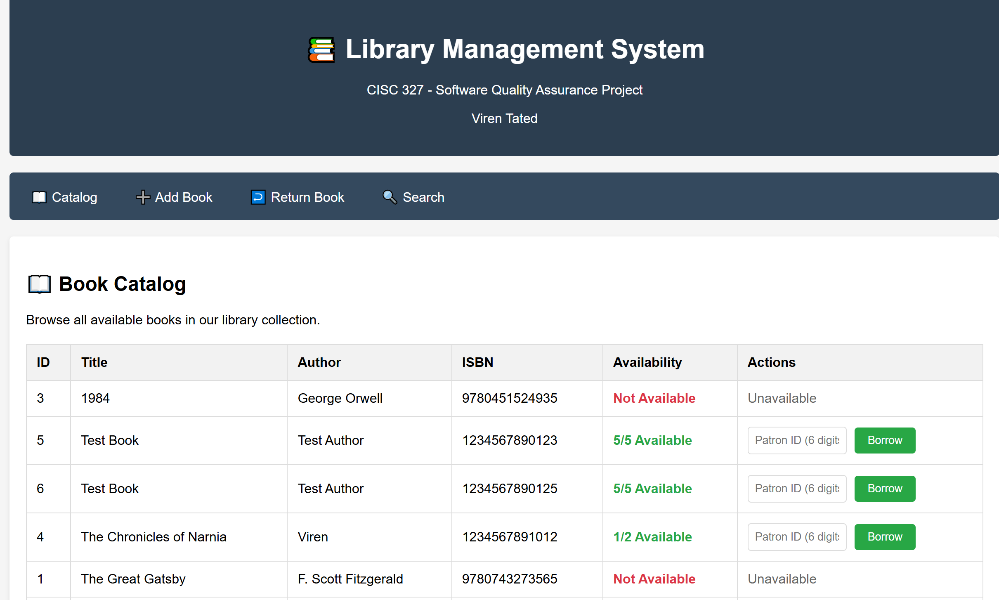
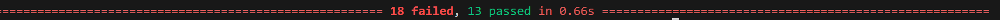

Name : Viren Tated
Student ID : 20335753
Group : 4   

## Successfull Web Application Execution
This line is to confirm that the web application was successfully executed and run locally. Please check  to see a screenshot of it running locally. Some test books were added as well. 

 ## Project Status Table
| Function Name                   | Implementation Status | Missing                                                                  |
|---------------------------------|-----------------------|--------------------------------------------------------------------------|
| `add_book_to_catalog`           | Complete              | None                                                                     |
| `get_all_books` (DB function)   | Complete              | Catalog display handled at route/template level. Not in business logic.  |
| `borrow_book_by_patron`         | Partial               | Borrow limit check bug: uses `> 5` instead of `>= 5`. Should block at 5. |
| `return_book_by_patron`         | Missing               | This function must validate both patron and book IDs, verify that the book was actually borrowed by the patron, update the borrow record with a return date, increment the available copy count in the books table, and calculate and display any late fees.                                                                                                 |

| `calculate_late_fee_for_book`   | Missing               | This function should retrieve the borrow record, calculate how many days overdue the book is beyond the 14-day loan period, apply the late fee rules ($0.50 per day for the first 7 days and $1.00 per day after that, capped at $15), and return a JSON response containing the fee amount, the days overdue, and a status message.                                  |

| `search_books_in_catalog`       | Missing               | This function should allow users to search by title or author with case-insensitive partial matches, search by ISBN with exact matches, query the database accordingly, and return the matching results as a list of book dictionaries.                                                                                                                        |

| `get_patron_status_report`      | Missing               | This function should compile a full patron report including the books currently borrowed with their due dates, the total late fees owed, the number of books currently borrowed, and the borrowing history, then return all of this information in a structured dictionary.                                                                                         |

Note : 'get_all_books' is the only DB function mentioned here as it is the only non-helper function from the "databse.py" file.

## Test Case Summary and Rationale
This section summarizes the unit tests written for Requirements R1–R7. Each requirement was tested with 4–5 cases that cover both positive and negative scenarios. The rationale explains why these specific cases were chosen and how they connect to the requirements specification.

### R1 – Add Book to Catalog
**Function tested:** `add_book_to_catalog`

- **Valid input:** Verifies that a properly formatted book entry (title, author, ISBN, copies) is successfully added.  This will fail if the book's ISBN is a duplicate one. Check result in . It does pass if the test is done with a different ISBN as can be seen after runnning the app. Check result in 
- **Invalid ISBN (too short):** Ensures ISBNs must be exactly 13 digits.  
- **Missing title:** Confirms the system rejects missing required fields.  
- **Author too long:** Tests the 100-character constraint for author names.  
- **Negative copies:** Ensures only positive integers are accepted for total copies.  

**Rationale:**  
These cases directly implement the input validation rules specified in R1. They confirm that valid inputs succeed, while errors in any of the required fields (title, author, ISBN, copies) produce clear error messages.

---

### R2 – Book Catalog Display
**Function tested:** `get_all_books`

- **Returns list:** Ensures catalog always returns a list, even if empty.  
- **Books contain required fields:** Verifies that each entry has `title`, `author`, and `isbn`.  
- **Books are dictionaries:** Confirms correct data structure for each catalog item.  
- **Copy counts are valid:** Tests that `total_copies` and `available_copies` are present and logically consistent (`available ≤ total`).  

**Rationale:**  
These tests check that the catalog display is structured consistently and meets the requirement of showing book details and copy counts. They safeguard against missing or invalid fields that would break the web interface.

---

### R3 – Borrow Book
**Function tested:** `borrow_book_by_patron`

- **Invalid patron ID:** Patron IDs must be exactly 6 digits; rejects invalid formats.  
- **Book not found:** Ensures invalid or non-existent book IDs are handled.  
- **Valid ID structure:** Confirms return type is always `(bool, str)` for consistent feedback.  
- **Message contains title or due date:** Verifies success messages are informative and contain expected details. This particular test will fail if the book is not available or real as seen in 
- **Borrow limit enforced:** Tests the rule that a patron cannot borrow more than 5 books.  

**Rationale:**  
These cases cover patron ID validation, book availability, borrowing limits, and feedback messages. They ensure the system enforces borrowing policies and provides meaningful responses for both success and failure.

---

### R4 – Return Book
**Function tested:** `return_book_by_patron`

- **Successful return updates availability:** Confirms books can be successfully returned.  
- **Invalid patron rejected:** Ensures invalid patron IDs are caught.  
- **Invalid book ID rejected:** Verifies non-existent book IDs are handled safely.  
- **Not borrowed by patron:** Tests that a patron cannot return books they never borrowed.  
- **Late fee calculation on return:** Ensures overdue returns include late fee information.  

Note: All these tests fail as the function is not implemented at all and none of the functionality is available. Check . 

**Rationale:**  
These tests map directly to R4 requirements: input validation, confirming borrow history before return, updating availability, and integrating late fee calculations. They ensure all parts of the return workflow function correctly.

---

### R5 – Late Fee Calculation
**Function tested:** `calculate_late_fee_for_book`

- **No overdue fee = $0:** Verifies that on-time returns do not generate fees.  
- **5 days overdue:** Confirms $0.50/day rule is applied correctly.  
- **10 days overdue:** Tests mixed-rate calculation (first 7 days at $0.50, remaining at $1/day).  
- **Fee capped at $15:** Ensures total fees never exceed maximum cap.  

**Rationale:**  
These tests validate the late fee business rules exactly as described in the requirements. They cover edge cases (no fee, mixed-rate fee, and capped fee) to confirm correct financial logic.

Note: All these tests fail as the function is not implemented at all and none of the functionality is available. Check . 

---

### R6 – Search Functionality
**Function tested:** `search_books_in_catalog`

- **Title partial match:** Confirms partial, case-insensitive matches by title.  
- **Author partial match:** Ensures partial matches for author names.  
- **ISBN exact match:** Tests strict exact match for ISBN searches.  
- **Invalid search type returns empty:** Confirms unsupported search types do not break the system.  

Note: Only the last test passes as the function is not implemented but still returns an empty list. Everything else fails as can be verified at .

**Rationale:**  
These tests map to R6’s requirement to support title, author, and ISBN searches, including partial and exact matching rules. They also confirm that invalid search parameters are handled gracefully.

---

### R7 – Patron Status Report
**Function tested:** `get_patron_status_report`

- **Has required keys:** Confirms that the report includes `borrowed_books`, `total_fees`, `books_borrowed_count`, and `history`.  
- **Books list contains due dates:** Ensures each borrowed book in the report shows a due date.  
- **Total fees nonnegative:** Confirms fees are never negative.  
- **Invalid patron returns empty:** Ensures system handles non-existent patrons safely.  

Note: All these tests fail as the function is not implemented at all and none of the functionality is available. Check . 

**Rationale:**  
These tests confirm that the patron status report provides complete and accurate information for both valid and invalid patrons. They map directly to R7’s specification for structure and content.

## Summary
All Functional Requirements (R1-R7) have been tested for and the current status of the projected has also been summarised in the first section. There are screenshots attached to show working proof of the test cases and the web application running. Given that we are trying to add an already added book in the `add_book_to_catalog` function we end up with 13 passed test cases and 18 failed test cases (total 31 tests). Check . The test suite successfully validates the requirements and highlights missing functionality, which can now be implemented with confidence. 